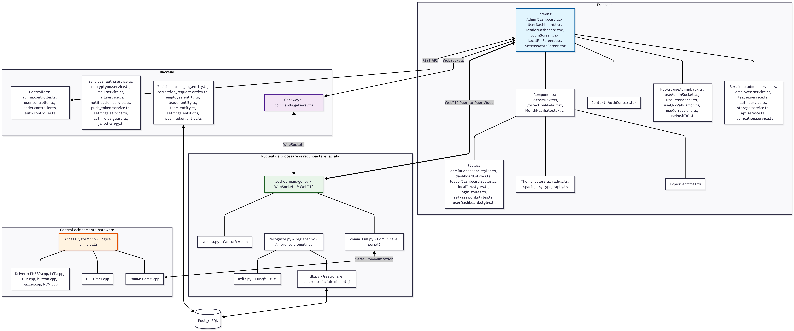
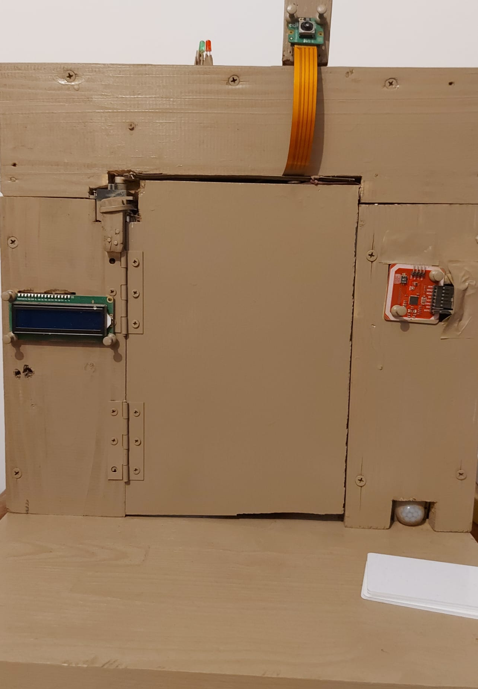
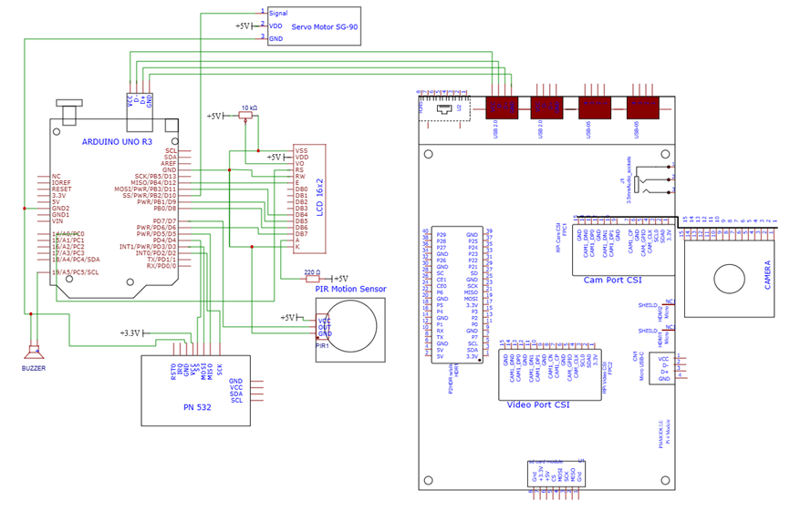
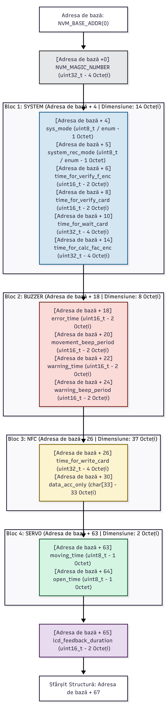
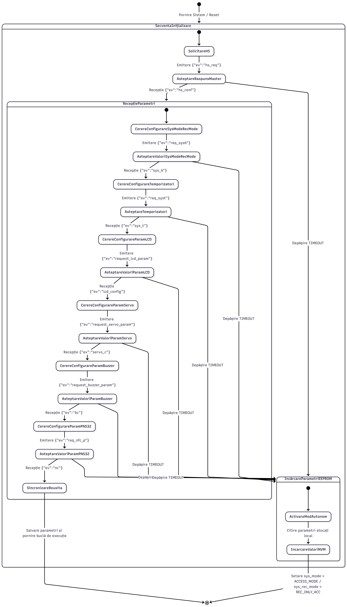
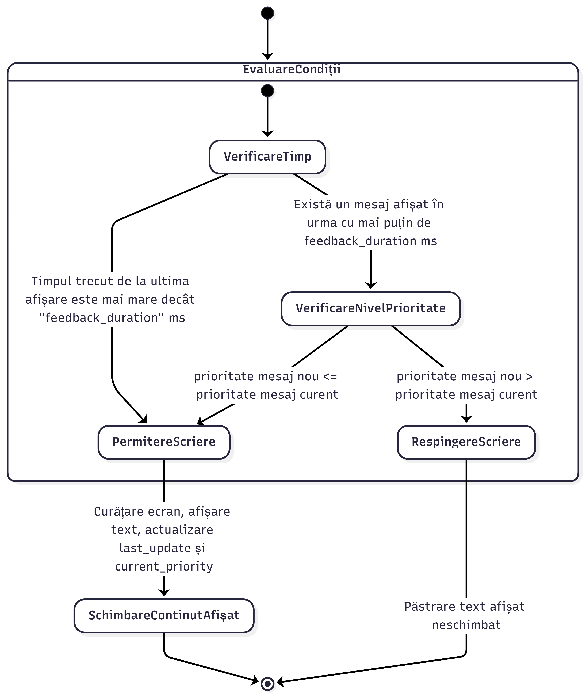
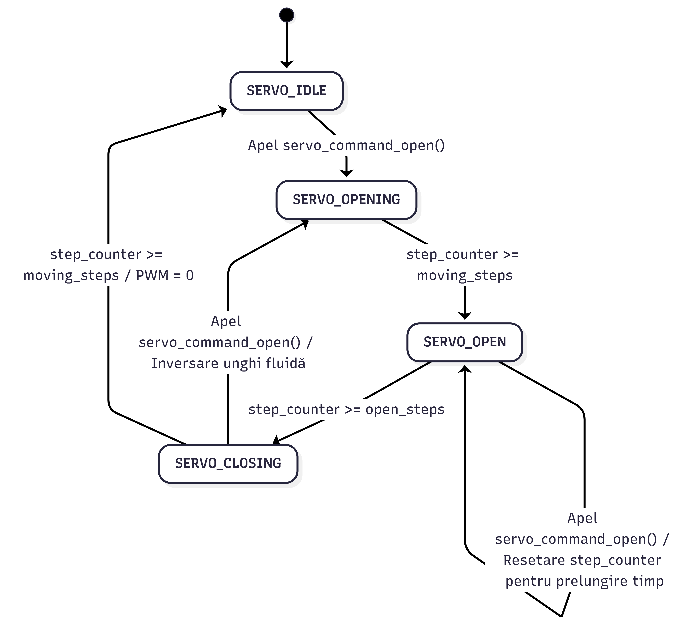
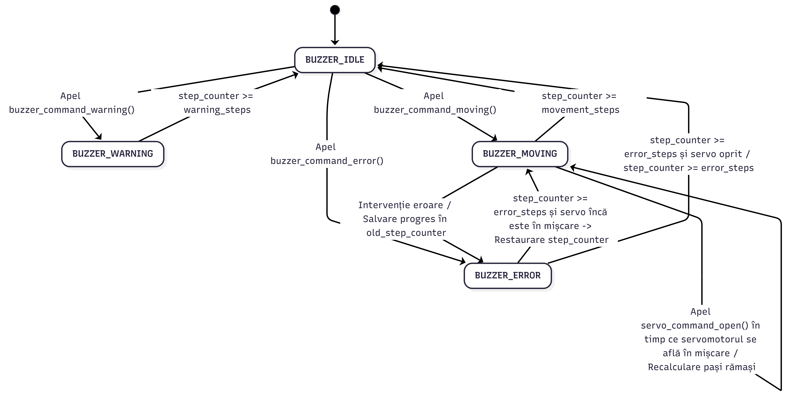

# Access_Control_System
This repository contains the C/C++ firmware for the Arduino Uno, serving as one of the two physical nodes within a heterogeneous **Distributed System for Personnel Identity and Access Management**.

### The architecture of the entire system
> 

### Physical Prototype
> 

While the system utilizes a Raspberry Pi 5 for high-level logic and facial recognition, this Arduino Uno R3 firmware acts as the real-time hardware execution unit. It seamlessly integrates various authentication methods to provide a scalable, secure, and dynamic access control solution tailored for modern organizational infrastructures.

This codebase heavily emphasizes embedded software best practices. It features a fully **event-driven, non-blocking architecture**, extensive use of **Finite State Machines** for peripheral control, and robust **EEPROM memory management** for standalone fail-safe operations.

### 1. Modular & Event-Driven Architecture
The firmware avoids blocking logic (e.g., completely avoiding `delay()` functions). Instead, it relies on an event-driven loop that reacts in real-time to external stimuli,among which PIR motion detection, RFID card scans, push-button interrupts, or UART serial commands. 

### 2. Finite State Machines
To ensure highly predictable system behavior, all major components and operating modes are governed by dedicated state machines:
* **System FSM** Manages high-level transitions between the *Access Control Mode* and *Card Writing/Enrollment Mode*.
* **Actuator FSM:** Controls the servomotor lifecycle (Closed -> Opening -> Open -> Closing).
* **Buzzer FSM:** Manages the active buzzer for non-blocking acoustic signals (continuous for errors, intermittent for warnings/actuation).

### 3. Fail-Safe & Standalone Operation
Upon boot, the Arduino initiates a JSON-based handshake via asynchronous UART with the central processing node. If the central node is unavailable (timeout > 3 seconds), the system automatically enters a **fallback standalone mode**. It retrieves synchronized configuration parameters from the local EEPROM and continues to provide basic RFID access control without network dependency.

## Hardware Integration

> 

The physical node interfaces with a diverse array of peripherals using multiple communication protocols:
* **RFID PN532 Module (SPI):** Reads Mifare Classic cards. Implements cryptographic sector authentication to extract encrypted IDs and digital signatures. Includes a strict anti-passback logic to prevent duplicate reads.
* **Servomotor (Hardware PWM):** Actuation is controlled at the register level using the ATmega328P's Timer 1, ensuring a smooth physical access simulation.
* **16x2 LCD Display (4-bit Parallel Interface):** Features a custom priority-based rendering logic. High-priority system alerts cannot be overwritten by low-priority guidance messages until a configurable timeout expires.
* **PIR Sensor & Push Button (GPIO):** Hardware debounced inputs for motion detection and manual system operating mode switching.

## Non-Volatile Memory Map
Dynamic system parameters (actuator timings, buzzer frequencies, RFID digital signatures) are stored locally in the EEPROM. 

Memory management is highly optimized:
* Utilizes a **Magic Number** mechanism for factory resets and memory corruption detection.
* Data is structured logically into functional blocks.
* Uses the `offsetof` macro for highly granular byte-level reads/writes, preventing unnecessary memory wear and allowing direct manipulation of specific parameters without loading the entire config file.

> 

## System Diagrams

To fully understand the non-blocking execution flow and component synchronization, refer to the state diagrams below:

### System Initialization & Parameter Synchronization
> 

### Main System FSM (Operating Modes)
> 

### LCD Priority Rendering Flow
> 

### Actuator & Buzzer FSMs
> 
> 

## Getting Started

### Prerequisites
To compile and flash this firmware, you will need the **Arduino IDE** and the following external libraries installed via the Library Manager:
*   `LiquidCrystal` (for the 16x2 LCD in 4-bit mode)
*   `Adafruit_PN532` (for the RFID SPI communication)

### Installation & Flashing
1.  **Clone the repository:**
    ```bash
    git clone https://github.com/danielbeniaminglavan/Access_Control_System
    ```
2.  **Open the project:** Open the AccessSystem `.ino` file in the Arduino IDE.
3.  **Configure Hardware:** Ensure all peripherals are connected according to the hardware schematic.
4.  **Select Board:** Go to `Tools > Board` and select **Arduino Uno**.
5.  **Select Port:** Go to `Tools > Port` and select the appropriate COM port.
6.  **Upload:** Click the Upload button to compile and flash the firmware to the microcontroller.

